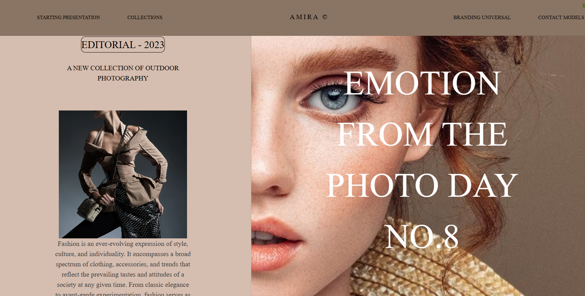

# 🌟 Fashion Blog with Next.js and GSAP 🛍️

Welcome to my Fashion Blog project! 🎉 This web application showcases stylish fashion content using Next.js and GSAP animations. 

## 🌐 Live Demo
https://amiraallagui.github.io/fashion-blog/

📸 Screenshots


## 🛠️ Tech Stack
Next.js: A React framework for server-rendered applications.
GSAP (GreenSock Animation Platform): Animation library for web development.

## 🎨 Features
Display fashion articles, photos, and styling tips.
Engaging animations powered by GSAP.

## 🚀 Getting Started

1. **Clone the repository:**

   ```bash
   git clone https://github.com/your-username/fashion-blog.git
   cd fashion-blog
   1-Install dependencies:npm install
   2-Run the development server:npm run dev

   The application will be available at http://localhost:3000.

